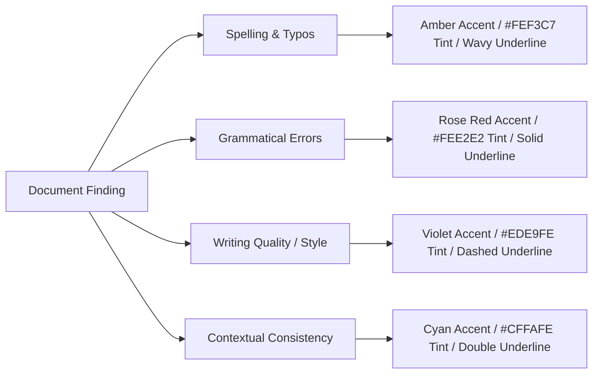
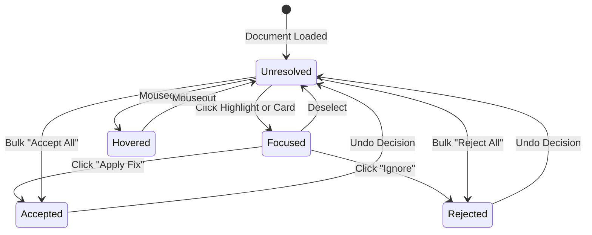

# Proofreading Annotation Layer Design Specification

## 1. Executive Overview

The **Proofreading Annotation Layer** is a lightweight, high-performance visual overlay layer positioned directly above the PDF document rendering viewport. It projects proofreading findings (spelling errors, grammatical flaws, readability bottlenecks, and contextual inconsistencies) onto the actual layout of the document without altering the underlying PDF binary or layout representation.

```
+-------------------------------------------------------------------+
|               Interactive Side Review Panel (~30%)                |
|  +-------------------------------------------------------------+  |
|  |  Category Filter Pills [ All | Grammar | Spelling | ... ]  |  |
|  +-------------------------------------------------------------+  |
|  |  Issue Card #1 (Selected)                                   |  |
|  |  Type: Spelling | Severity: High | Confidence: 96%         |  |
|  |  Original: "implimentation"  ->  Suggested: "implementation"|  |
|  |  [ ✓ Apply Fix ]   [ ✗ Ignore ]                            |  |
|  +-------------------------------------------------------------+  |
+-------------------------------------------------------------------+
|               PDF Viewport & Annotation Layer (~70%)              |
|  +-------------------------------------------------------------+  |
|  | Page 1 Header / Logo / Multi-column Layout                 |  |
|  | ... layout text ... <MARK: Amber Highlight>implimentation    |  |
|  | ... text tables ... <MARK: Red Highlight>were compiled     |  |
|  +-------------------------------------------------------------+  |
+-------------------------------------------------------------------+
```

---

## 2. Spatial Indexing & Coordinate Mapping Model

The annotation layer maps NLP findings (character range offsets and token matches) into exact visual spatial coordinates on the rendered document page.

### A. Data Schema for Spatial Annotations
Each issue payload returned by the proofreading engine includes spatial coordinates alongside textual offsets:

```json
{
  "issue_id": "iss_78942",
  "issue_type": "spelling",
  "severity": "high",
  "char_start": 412,
  "char_end": 426,
  "page_index": 1,
  "bounding_boxes": [
    {
      "x0": 112.5,
      "y0": 248.0,
      "x1": 218.0,
      "y1": 262.5,
      "width": 105.5,
      "height": 14.5
    }
  ],
  "original_text": "implimentation",
  "suggested_text": "implementation",
  "explanation": "Spelling mistake detected: 'implimentation' should be spelled 'implementation'.",
  "confidence": 0.96,
  "category": "Spelling & Typography"
}
```

### B. Multi-Line Text Line Rect Mapping
When a proofreading finding spans multiple lines (e.g., a multi-word grammatical error across line boundaries), `bounding_boxes` contains an array of line bounding boxes:

$$\text{LineRect}_k = [x_{0,k}, y_{0,k}, x_{1,k}, y_{1,k}], \quad k \in \{1, \dots, N\}$$

The annotation layer renders an overlay mark for each bounding rectangle in the collection, grouping them under a unified `data-issue-id` handle.

---

## 3. Highlight Categories & Design Tokens

Finding categories are visually distinguished using distinct color tokens, wavy/solid underline styles, and background tints:



### Color Specification Token Matrix

| Issue Category | Primary Accent | Background Tint | Border / Underline | Hover Glow |
| :--- | :--- | :--- | :--- | :--- |
| **Spelling** | `#D97706` (Amber 600) | `#FEF3C7` | `2px wavy #D97706` | `0 0 0 3px rgba(217,119,6,0.3)` |
| **Grammar** | `#DC2626` (Red 600) | `#FEE2E2` | `2px solid #DC2626` | `0 0 0 3px rgba(220,38,38,0.3)` |
| **Writing Quality** | `#7C3AED` (Violet 600) | `#EDE9FE` | `2px dashed #7C3AED` | `0 0 0 3px rgba(124,58,237,0.3)` |
| **Consistency** | `#0891B2` (Cyan 600) | `#CFFAFE` | `2px double #0891B2` | `0 0 0 3px rgba(8,145,178,0.3)` |
| **Applied (Accepted)**| `#059669` (Emerald 600) | `#E2F0D9` | `none` | `none` |

---

## 4. Interaction Lifecycle & State Machine

Every finding transitions through deterministic interaction states managed by React state (`issueDecisions` and `activeIssueIdx`):



### State Definitions:
1. **Unresolved (Pending)**: Highlight rendered in document with category color. Card visible in side panel.
2. **Hovered**: Highlight scales slightly (1.02x) with ambient glow; tooltip appears above document text.
3. **Focused (Active)**: Highlight receives active ring (`2px solid var(--brand)`), smooth-scrolls into viewport center; side panel card expands.
4. **Accepted (Applied)**: Original text replaced with `suggested_text`; highlight transitions to soft green (`#E2F0D9`).
5. **Rejected (Ignored)**: Highlight removed from canvas view; card hidden or marked dismissed.

---

## 5. Side Review Panel Specification

The Side Review Panel provides complete inspection metrics for selected findings:

### Card Layout Components
1. **Header Row**: Issue type badge, severity indicator (Low, Medium, High, Critical), confidence gauge badge (e.g. `96% Confidence`).
2. **Text Diff Box**:
   - **Original (Strikethrough)**: `implimentation` (Red tint)
   - **Suggested (Bold)**: `implementation` (Green tint)
3. **Explanation Block**: Detailed rationale explaining the rule violation or context contradiction.
4. **Action Footer**:
   - **[ ✓ Apply Fix ]**: Applies suggestion, updates overlay & clean preview.
   - **[ ✗ Ignore ]**: Dismisses finding, removes highlight.

---

## 6. Bi-Directional Synchronization Contract

The synchronization mechanism guarantees seamless parity between the document viewport and side panel:

```
[ PDF Document Viewport ]  <========== (Bi-Directional Sync) ==========>  [ Side Review Panel ]
  Click Canvas Highlight  --------------------------------------->  Auto-scroll & Expand Card
  Scroll Canvas Page      <---------------------------------------  Click Card in Side Panel
```

1. **Document-to-Panel Sync**:
   - User clicks `<mark data-issue-idx="3">`.
   - `setActiveIssueIdx(3)` triggers.
   - Panel executes `document.getElementById('suggestion-3').scrollIntoView({ behavior: 'smooth', block: 'nearest' })`.

2. **Panel-to-Document Sync**:
   - User clicks issue card `#suggestion-3` in side panel.
   - `setActiveIssueIdx(3)` triggers.
   - Viewport locates target element/coordinates and smooth-scrolls canvas to focus line.
