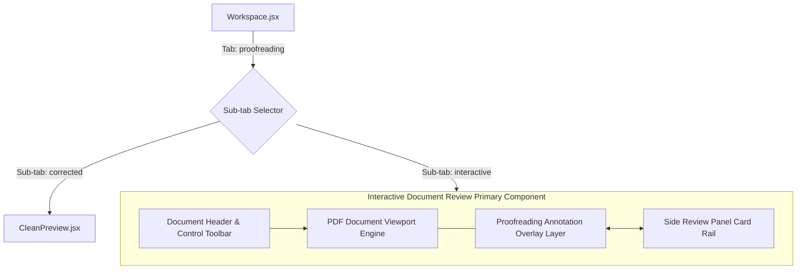

# Interactive Document Review Implementation & Component Guide

## 1. Frontend Implementation Overview

The **Interactive Document Review** implementation integrates the document viewing layer with finding highlights, page navigation, zoom controls, and a bi-directional side review panel into `ai-proofreader-frontend`.

```
src/
├── components/
│   ├── Workspace.jsx                     # Primary Workspace container orchestrating sub-tabs
│   ├── InteractiveDocumentReview.jsx     # Combined Original PDF Viewport + Annotation Overlay + Side Panel
│   ├── CleanPreview.jsx                  # Resolved final document output & export view
│   └── ...
```

---

## 2. Component Hierarchy & Modular Architecture



---

## 3. State Management Hooks Matrix

The state for the Interactive Document Review workspace is managed reactively through React hooks:

| State Variable | Type | Default Value | Purpose / Trigger |
| :--- | :--- | :--- | :--- |
| `proofSubTab` | `string` | `"interactive"` | Active sub-tab mode (`"interactive"` or `"corrected"`) |
| `zoomLevel` | `number` | `100` | Current zoom percentage ($50\%, 75\%, 100\%, 125\%, 150\%$) |
| `currentPage` | `number` | `1` | Active page index for multi-page navigation |
| `activeIssueIdx` | `number \| null` | `null` | Index of currently selected/focused proofreading finding |
| `issueDecisions` | `Record<number, 'accepted' \| 'rejected'>` | `{}` | Map tracking resolution decisions for each issue |
| `typeFilter` | `string` | `"all"` | Category filter (`"all"`, `"grammar"`, `"spelling"`, `"quality"`, `"consistency"`) |
| `search` | `string` | `""` | Search string for filtering issues in real time |
| `viewMode` | `string` | `"continuous"` | Viewport mode (`"continuous"` or `"single"`) |

---

## 4. Key Implementation Details & Code Contracts

### A. Document Canvas & Annotation Overlay Composition
In `InteractiveDocumentReview.jsx`, the document canvas embeds the original document file served by `/api/documents/{id}/file` while layering interactive issue annotations over the paper representation:

```jsx
// Excerpt from InteractiveDocumentReview component
<div className="interactive-review-container" style={styles.reviewLayout}>
  {/* Left Panel: Original Document Viewport + Annotation Overlay */}
  <div style={styles.documentViewportContainer}>
    {/* Page Controls Toolbar */}
    <div style={styles.viewportToolbar}>
      <div style={styles.leftControls}>
        <span style={styles.docBadge}>📄 {doc.filename}</span>
        <span style={styles.pageIndicator}>Page {currentPage} of {doc.page_count || 1}</span>
      </div>
      
      <div style={styles.toolbarActions}>
        {/* Zoom Controls */}
        <button onClick={() => setZoomLevel(z => Math.max(50, z - 15))}>-</button>
        <span>{zoomLevel}%</span>
        <button onClick={() => setZoomLevel(z => Math.min(200, z + 15))}>+</button>
        <button onClick={() => setZoomLevel(100)}>Fit Page</button>
      </div>
    </div>

    {/* Scalable PDF Paper Viewport */}
    <div style={{ transform: `scale(${zoomLevel / 100})`, transformOrigin: "top center" }}>
      <div className="pdf-paper-sheet" style={styles.paperSheet}>
        {/* Annotation Layer rendered directly on document layout */}
        {renderAnnotatedDocumentContent()}
      </div>
    </div>
  </div>

  {/* Right Panel: Side Review Cards Rail */}
  <SideReviewPanel
    issues={visibleIssues}
    activeIdx={activeIssueIdx}
    decisions={issueDecisions}
    onApplyFix={handleApplyFix}
    onIgnore={handleIgnore}
    onSelect={handleSelectIssue}
  />
</div>
```

---

## 5. Action Handlers Logic

### A. Single Issue Resolution Handlers
```javascript
const handleApplyFix = (issueIdx) => {
  setIssueDecisions(prev => ({
    ...prev,
    [issueIdx]: "accepted"
  }));
};

const handleIgnore = (issueIdx) => {
  setIssueDecisions(prev => ({
    ...prev,
    [issueIdx]: "rejected"
  }));
};
```

### B. Bulk Operations Handlers
```javascript
const handleAcceptAll = () => {
  const newDecisions = { ...issueDecisions };
  visibleIssues.forEach(issue => {
    newDecisions[issue.originalIndex] = "accepted";
  });
  setIssueDecisions(newDecisions);
};

const handleRejectAll = () => {
  const newDecisions = { ...issueDecisions };
  visibleIssues.forEach(issue => {
    newDecisions[issue.originalIndex] = "rejected";
  });
  setIssueDecisions(newDecisions);
};
```

---

## 6. Integration Verification & Test Strategy

1. **Original View Integration Test**: Verify `/api/documents/{id}/file` returns `application/pdf` (or original format) and mounts smoothly into the viewport.
2. **Annotation Rendering Test**: Ensure all issues in `doc.issues` render with correct category colors (`spelling`, `grammar`, `quality`, `consistency`).
3. **Bi-directional Focus Test**: Verify clicking a document mark sets `activeIssueIdx` and scrolls the side card into view, and vice versa.
4. **Resolution Sync Test**: Confirm clicking "Apply Fix" updates both the annotation highlight state and the **Clean Preview** text representation.
