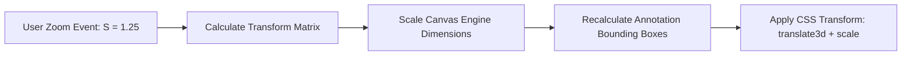

# PDF Highlighting & Dual-Layer Rendering Architecture

## 1. Technical Architecture Overview

The core architectural equation driving the redesigned **Interactive Document Review** experience is:

$$\text{PDF Rendering Layer} + \text{Proofreading Annotation Layer} = \text{Interactive Review}$$

Rather than creating a secondary, lossy representation of the document (such as plaintext containers or raw HTML extraction), Interactive Review mounts the **original PDF document** directly into the viewport and overlays an interactive **Annotation Highlighting Layer**.

```mermaid
graph TD
    Sub[Document Binary Endpoint: /api/documents/{id}/file] --> Viewport[Interactive Review Canvas]
    
    subgraph Viewport [Dual-Layer Viewport Engine]
        L1[Layer 0: PDF Base Render Canvas / Frame]
        L2[Layer 1: DOM Text & Layout Anchor Layer]
        L3[Layer 2: SVG/HTML Annotation Overlay]
        L4[Layer 3: Floating Action Tooltips & Context Menus]
        
        L1 --> L2
        L2 --> L3
        L3 --> L4
    end
    
    Viewport <--> Sync[Bi-Directional State & Event Engine]
    Sync <--> Panel[Side Review Panel Card Rail]
```

---

## 2. Layering Stack Diagram & DOM Composition

The viewport is constructed using a strict 4-tier `z-index` stacking context to allow fluid text interaction, visual highlight rendering, and crisp PDF graphic display:

```
+-------------------------------------------------------------------------+
| Layer 3: Floating Tooltips & Focus Controls   (z-index: 40)             |
+-------------------------------------------------------------------------+
| Layer 2: Interactive Highlight Annotations     (z-index: 20, pointer-ev) |
+-------------------------------------------------------------------------+
| Layer 1: PDF Text Selection & Bounding Layer  (z-index: 10, opacity:0)  |
+-------------------------------------------------------------------------+
| Layer 0: Base PDF Vector & Canvas Renderer    (z-index: 1)              |
+-------------------------------------------------------------------------+
```

### Layer Responsibilities
1. **Layer 0 (Base PDF Canvas / View Engine)**: Renders vector shapes, images, logos, tables, fonts, and background page graphics with 100% visual fidelity matching the native document file.
2. **Layer 1 (Text Layer / Bounding Index)**: Contains DOM spans matching exact text bounds for native browser selection, copy/paste, and spatial bounding box queries.
3. **Layer 2 (Annotation Highlighting Overlay)**: Renders `<mark>` and SVG rect overlays directly above target text segments. Receives hover and click events.
4. **Layer 3 (Floating UI & Tooltips)**: Renders quick-action popovers, confidence score indicators, and inline fix buttons.

---

## 3. Zoom & Pan Transform Mathematics

When users change the zoom level (e.g., 50%, 75%, 100%, 125%, 150%, Fit Width), spatial bounding box coordinates must scale dynamically without blurriness or displacement.

### Coordinate Transform Equations

Given a bounding box coordinate on page $P$ at scale factor $S = 1.0$ (100% scale):

$$\text{Box}_{\text{base}} = [x_0, y_0, w, h]$$

When zoom scale factor $S \in [0.5, 2.0]$ is applied, the transformed viewport position $[X_{\text{screen}}, Y_{\text{screen}}, W_{\text{screen}}, H_{\text{screen}}]$ is calculated via:

$$X_{\text{screen}} = (x_0 \cdot S) + X_{\text{page\_offset}}$$

$$Y_{\text{screen}} = (y_0 \cdot S) + Y_{\text{page\_offset}}$$

$$W_{\text{screen}} = w \cdot S$$

$$H_{\text{screen}} = h \cdot S$$



By applying hardware-accelerated CSS `transform: translate3d(x, y, 0) scale(S)`, scaling runs at 60 FPS without triggering costly DOM reflows.

---

## 4. Multi-Page Navigation & Viewport Virtualization

For large multi-page enterprise documents (50+ pages), rendering all page annotations simultaneously degrades DOM performance. The architecture uses an **IntersectionObserver Virtualization Engine**:

```
[ Virtualized Viewport Container ]
  Page 1 (Off-screen) -> Unloaded Annotation Nodes (Placeholder height preserved)
  Page 2 (In Viewport) -> Fully Active PDF Canvas + Rendered Annotation Overlay
  Page 3 (In Viewport) -> Fully Active PDF Canvas + Rendered Annotation Overlay
  Page 4 (Off-screen) -> Unloaded Annotation Nodes
```

### Page Observer Protocol
1. **Viewport Sensor**: An `IntersectionObserver` attached to page containers tracks which page numbers are currently visible in the scroll container.
2. **Page Indicator Sync**: Updates the header page control (`Page X of Y`) in real time as the user scrolls continuously.
3. **Lazy Annotation Mount**: Annotation elements for page $P$ are instantiated only when page $P$ enters within a 300px margin of the viewport bounds.

---

## 5. Performance Optimizations & Batching Strategy

| Optimization Technique | Description | Impact |
| :--- | :--- | :--- |
| **DOM Element Pooling** | Reuses annotation mark DOM nodes during filter changes rather than destroying/recreating DOM elements | Eliminates garbage collection pauses during filtering |
| **RequestAnimationFrame Debounce** | Debounces scroll and resize coordinate recalculations to sync with browser repaint cycles | Maintains smooth 60 FPS scrolling performance |
| **CSS Containment (`contain: strict`)** | Applies CSS containment to individual page viewport elements | Prevents layout reflows from leaking across page boundaries |
| **Memoized Text Markup Renderer** | Uses React `useMemo` for sorting and rendering document markup arrays | Minimizes re-render calculations to $< 5\text{ms}$ |
