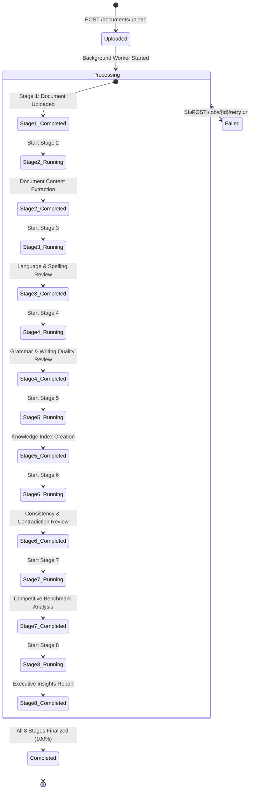
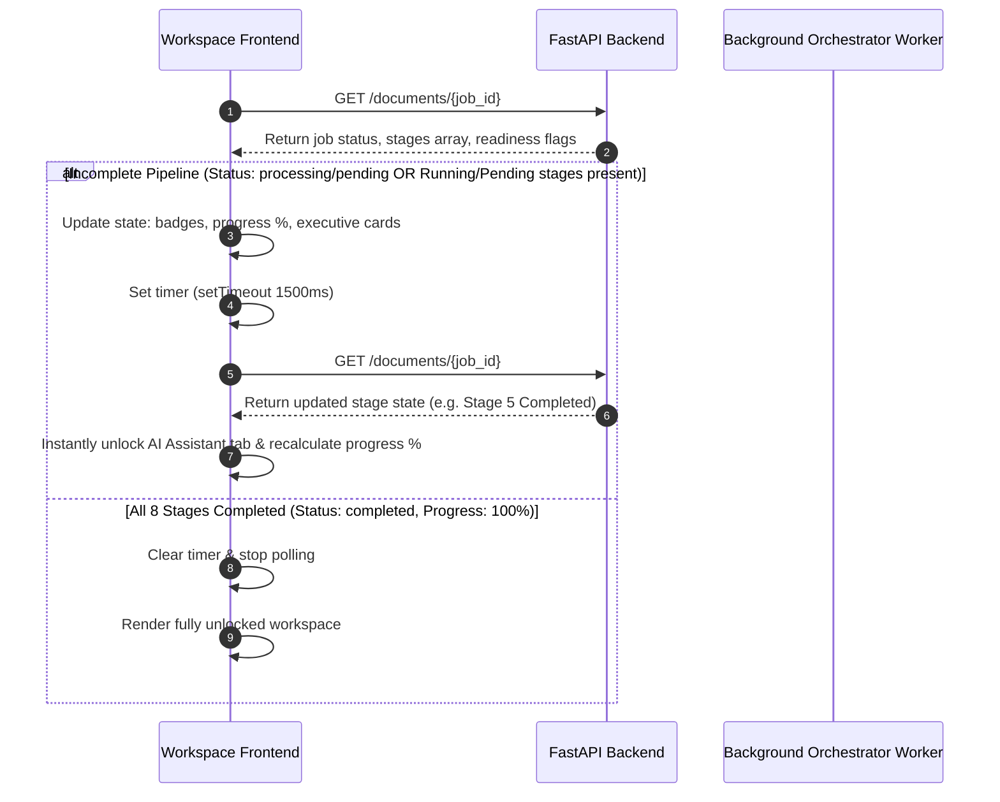
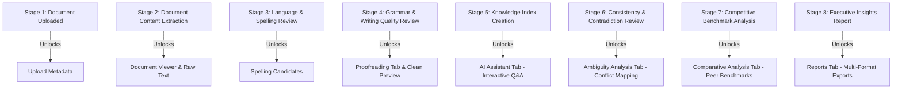

# Pipeline State Flow & Transition Architecture

## Overview
This document specifies the lifecycle state transitions, automatic polling mechanism, stage unlocking rules, and error recovery flows governing document processing in the platform.

---

## 1. Lifecycle State Machine Diagram

---

## 2. Dynamic Frontend Polling Flow

---

## 3. Feature Unlock Dependency Rules

---

## 4. Stage Failure & Auto-Resume Flow

1. **Failure Signal**: If an uncaught exception occurs during stage execution (e.g., in Stage 5: Knowledge Index Creation), the orchestrator catches the exception, updates stage status to `Failed`, and sets `s.errors = traceback.format_exc()`.
2. **UI Notification**: Polling detects `status === "Failed"` for Stage 5. `StagePipelineCard` turns Stage 5 red, displays the exact failure reason snippet, and renders a "Retry Stage" button.
3. **User Action**: The user clicks "Retry Stage" on Stage 5.
4. **Backend Reset**: Frontend calls `POST /jobs/{job_id}/retry?stage_id=stage_5_rag`. Backend sets Stage 5 status to `Pending`, clears errors, sets job status to `pending`, saves metadata, and enqueues job in background worker.
5. **Resume Polling**: Frontend immediately updates UI state and restarts 1.5s polling loop. Stage 5 status updates `Pending` $\rightarrow$ `Running` $\rightarrow$ `Completed`.
