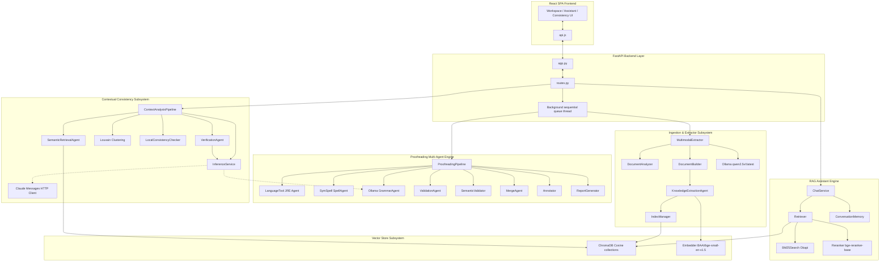

# Document Proofreading and Multimodal RAG Platform: Technical Audit & Status Report

This report presents a complete technical audit of the current implementation of the Document Proofreading and Multimodal RAG Platform, compiled prior to Claude integration.

---

## PART 1 — PROJECT OVERVIEW

### Overall Objective
The Document Proofreading and Multimodal RAG Platform is an enterprise-grade document processing, proofreading, and question-answering system. It provides a multi-agent, layout-aware grammar and spelling proofreading engine (Grammarly-style corrections) alongside a high-performance Multimodal RAG (Retrieval-Augmented Generation) assistant. The system is designed to handle complex, multi-page business documents (PDFs, DOCXs, and TXTs), automatically detect inconsistencies or contradictions across different sections (Contextual Consistency Analysis), and allow users to query the documents interactively.

### Main Architecture
The platform is built on a split client-server architecture:
1. **Frontend**: A React single-page application built with Vite and styled using Vanilla CSS. It provides a split-pane interactive Workspace, an AI chat panel, a document viewer, and a Contextual Consistency dashboard.
2. **Backend**: A FastAPI server running in Python, utilizing an asynchronous event model and a background execution worker thread. Jobs are queued sequentially to manage resource consumption and avoid CPU/GPU thread contention.
3. **Audit and LLM Services**: Locally-hosted LLM instances managed via Ollama (defaulting to `qwen2.5-coder:32b` for reasoning and RAG and `qwen2.5vl:latest` for VLM vision-based document element descriptions), alongside LanguageTool JRE server processes and SymSpell dictionaries.

### Major Workflows
1. **Ingestion Workflow**:
   - Document upload triggers metadata registration.
   - The document is passed through the pre-parsing `DocumentAnalyzer` to select the processing strategy (scanned vs. digital, page-batch sizes, OCR status).
   - The file is converted page-by-page in batches via the `MultimodalExtractor` (leveraging Docling or falling back to PyMuPDF).
   - Images and tables are extracted, sequentialized, and stored.
   - Images are processed by the VLM (`qwen2.5vl`) unless filtered out as decorative.
   - Elements are transformed into `KnowledgeObject` structures, embedded using SentenceTransformers, and loaded into ChromaDB.
2. **Proofreading Workflow**:
   - Normalized text is parsed.
   - Character offsets for paragraphs and sentences are indexed at the document level.
   - Protected terms (regex patterns, SpaCy NER, common technical words, repeating nouns) are extracted.
   - Grammar and spelling candidates are proposed by `LanguageToolAgent` and `SpellAgent` (SymSpell fallback).
   - Level-2 grammar audits are executed on paragraphs via the local LLM (`GrammarAgent`).
   - Edits are validated against protected terms (`ValidationAgent`) and semantic shift (`SemanticValidator`).
   - The `DifferenceEngine` confirms span offset math, and the `MergeAgent` resolves conflicts and filters out issues with confidence $\le 0.50$.
   - Final deliverables (Annotated HTML, Corrected HTML, JSON/Markdown/CSV reports) are compiled.
3. **RAG & Chat Workflow**:
   - Natural language queries are processed for intent detection and synonym expansion.
   - Hybrid retrieval is executed (BM25 sparse search + ChromaDB dense cosine similarity vector search + exact metadata matching + entity indexes).
   - Candidate chunks are boosted based on intent (boosting table chunks, figures, etc.) and passed through a Cross-Encoder reranker.
   - Used chunks are contextually expanded using the structured layout tree and loaded into the LLM prompt.
   - Chat history is stored in an in-memory document-scoped cache.

---

## PART 2 — FOLDER STRUCTURE

The workspace directory tree is structured as follows:

```
DocumentProofreadingSystem/
├── backend/                             # FastAPI application layer
│   ├── app.py                           # Main application entry point & CORS
│   ├── routes.py                        # REST API routing endpoints (RAG & Proofread)
│   ├── schemas.py                       # Pydantic schema validation models
│   └── services.py                      # Job state, sequential queue, & background thread
├── src/                                 # Core Python business logic & pipelines
│   ├── rag/                             # RAG Assistant & Contextual Consistency modules
│   │   ├── contextual_analysis/         # Contextual Consistency Analysis pipeline
│   │   │   ├── prompts/                 # Prompt templates for audits & verifications
│   │   │   │   ├── analysis_prompt.txt
│   │   │   │   ├── system_prompt.txt
│   │   │   │   └── verification_prompt.txt
│   │   │   ├── agents.py                # CandidateBuilder, Analysis, & Verification Agents
│   │   │   ├── clustering.py            # Louvain community detection
│   │   │   ├── inference_service.py     # LLM query wrapper (Ollama/Claude API helper)
│   │   │   ├── local_checks.py          # Deterministic local checkers (numeric/page reference)
│   │   │   ├── models.py                # Data classes for inconsistency issues
│   │   │   ├── pipeline.py              # Contextual Analysis orchestrator pipeline
│   │   │   ├── report_generator.py      # Mappers and HTML/JSON report builders
│   │   │   └── semantic_retrieval_agent.py # Retrieval of similar object pairs from ChromaDB
│   │   ├── bm25_search.py               # Sparse lexical search (Rank-BM25 Okapi)
│   │   ├── caption_processor.py         # Image/Table caption extraction
│   │   ├── chat_service.py              # RAG query handler & answer generator
│   │   ├── chunk_builder.py             # Layout elements chunking & NER enrichments
│   │   ├── chunk_schema.py              # DocumentChunk & ChunkMetadata Pydantic models
│   │   ├── chunk_utils.py               # Token estimators, word counters, section formatters
│   │   ├── config.py                    # RAG config defaults (top-k, models, similarity thresholds)
│   │   ├── context_builder.py           # Context assembly, page references, used-chunk lists
│   │   ├── conversation_memory.py       # In-memory document-scoped chat turns cache
│   │   ├── document_builder.py          # Docling-to-structured layout elements mapper
│   │   ├── document_schema.py           # Layout elements, tables grid, bounding boxes schemas
│   │   ├── embedder.py                  # Embedding generation coordinator
│   │   ├── embedding_provider.py        # SentenceTransformers provider (CPU/GPU)
│   │   ├── hybrid_search.py             # Reciprocal Rank Fusion (RRF) combiner
│   │   ├── image_processor.py           # Extracts bounding box image coordinates
│   │   ├── index_manager.py             # Handles loading, index checks, & database updates
│   │   ├── knowledge_objects.py         # KnowledgeObject data model
│   │   ├── llm.py                       # Supported models metadata configurations
│   │   ├── multimodal_extractor.py      # Page-streaming converter, VLM desc generator
│   │   ├── ollama_client.py             # HTTP client wrapper for Ollama generate/vision APIs
│   │   ├── prompt_builder.py            # RAG System/Context prompt assembler
│   │   ├── query_processor.py           # Query embedding generator & normalizer
│   │   ├── reranker.py                  # Cross-Encoder candidate scorer (bge-reranker-base)
│   │   ├── response_models.py           # API response types (GroundedAnswerResponse)
│   │   ├── retrieval_models.py          # Internal retrieval structures (ScoredChunk)
│   │   ├── table_processor.py           # Reconstructs grids, exports JSON/CSV/MD/HTML
│   │   ├── utils.py                     # Coordinates mapper helper
│   │   └── vector_store.py              # ChromaDB collection creation & upsert controller
│   ├── annotator.py                     # Re-inserts corrected spans, builds Legend HTML
│   ├── config.py                        # Paths and settings for proofreading stages
│   ├── difference_engine.py             # Compares original vs replacement text offsets
│   ├── extractor.py                     # Document extractor delegating to MultimodalExtractor
│   ├── filter.py                        # Removes non-running text (headers, page numbers)
│   ├── grammar_agent.py                 # LLM paragraph reviewer client
│   ├── html_writer.py                   # Legend & style container shell for corrected text
│   ├── languagetool_agent.py            # LanguageTool spelling & grammar validation client
│   ├── layout_analyzer.py               # Identifies and marks LayoutBlocks
│   ├── logger.py                        # Logging handlers & stage tracking
│   ├── merge_agent.py                   # Deduplicates issues & resolves conflicting spans
│   ├── models.py                        # Data models (Paragraph, Sentence, Candidate, MergedIssue)
│   ├── paragraph_builder.py             # Groups running lines into logical paragraph blocks
│   ├── pipeline.py                      # Orchestrator for the 16 proofreading stages
│   ├── preprocessing.py                 # Sanitizes and normalizes raw text
│   ├── protected_terms.py               # Protected terms builder (NER + regex + repeating words)
│   ├── report_generator.py              # Proofread changes.md/summary.csv/report.json builder
│   ├── semantic_validator.py            # Ollama-based semantic shift check
│   ├── sentence_splitter.py             # Splits sentences using SpaCy
│   ├── spell_agent.py                   # SymSpell-based spellchecker (fallback)
│   ├── text_writer.py                   # Helper to save string reports
│   ├── utils.py                         # Dataclass converters, JSON readers/writers
│   └── validation_agent.py              # Overlap checker rejecting edits on protected terms
├── ai-proofreader-frontend/              # React Frontend Project
│   ├── src/
│   │   ├── components/                  # UI Components
│   │   │   ├── Assistant.jsx            # RAG AI Chat interface panel
│   │   │   ├── ContextAnalysis.jsx      # Consistency audit executive dashboard
│   │   │   ├── History.jsx              # Audit history list
│   │   │   ├── ProofreadingEmptyState.jsx # Default state screen
│   │   │   ├── RecentDocuments.jsx      # Documents grid
│   │   │   ├── Reports.jsx              # Reports downloads list
│   │   │   ├── Settings.jsx             # Preferences page
│   │   │   ├── Sidebar.jsx              # App sidebar with status checks
│   │   │   ├── StatCard.jsx             # Dashboard metric card
│   │   │   ├── TopBar.jsx               # Breadcrumbs and global controls
│   │   │   ├── UploadZone.jsx           # Upload dropzone
│   │   │   └── Workspace.jsx            # Interactive Workspace (splits original/corrected HTML)
│   │   ├── api.js                       # Axios/fetch calls to routes.py
│   │   ├── index.css                    # UI color tokens & CSS styles
│   │   └── App.jsx                      # Main React routing framework
│   ├── index.html                       # HTML page container
│   ├── vite.config.js                   # Vite dev-server proxy setup
│   └── package.json                     # Dependency file
├── models/                              # Local model files and frequency dicts
│   └── frequency_dictionary_en_82_765.txt # SymSpell dictionary
├── data/                                # Directory for documents, databases, & configs
│   ├── input/                           # Source uploaded documents
│   ├── output/                          # Stage outputs & job reports
│   ├── chromadb/                        # ChromaDB persistent database files
│   └── protected_terms_whitelist.json   # Whitelisted terms
├── requirements.txt                     # Main project Python dependencies
└── main.py                              # CLI runner entrypoint
```

---

## PART 3 — INGESTION ENGINE

The ingestion pipeline converts a document into a structured digital layout, extracts semantic knowledge objects, and builds a vector index.

```
Upload 
  │
  ▼
Document Analyzer (Determines metadata, scanned vs. digital, page-batch splits)
  │
  ▼
Streaming Batches (PDF cropped into batch-range files to protect memory)
  │
  ▼
Docling Converter (Attempts layout extraction with OCR / table settings)
  │
  ▼
Fallback Extractor (Uses PyMuPDF / python-docx / txt if Docling fails or is missing)
  │
  ▼
Structured Document (DocumentBuilder creates layout elements, images, & tables)
  │
  ▼
VLM Vision Processing (qwen2.5vl:latest describes images; decorative ones are skipped)
  │
  ▼
Knowledge Object Extraction (Typed segments: Paragraphs, Headings, Tables, Images, Cells)
  │
  ▼
Embedding & Vector Database Update (SentenceTransformers + ChromaDB cosine similarity)
```

### Ingestion Details
- **Batch Processing**: Instead of reading the entire document into memory, the `MultimodalExtractor` runs in batches. Large files are split using PyMuPDF (`fitz`), saving small cropped PDF files temporarily. These batches are converted sequentially. Batch sizes are determined dynamically:
  - Scanned PDF (OCR enabled): 5 pages per batch.
  - Large Digital PDF (> 100 pages): 15 pages per batch.
  - Standard Digital PDF: 25 pages per batch.
  - DOCX / TXT: Processed as single batches.
- **Memory Optimization**: In the page-streaming batch loop, raw layout objects and temporary conversion outputs are deleted. Python's garbage collector (`gc.collect()`) is called explicitly, and the PyTorch GPU memory cache (`torch.cuda.empty_cache()`) is cleared at the end of each batch.
- **Checkpointing & Resume**: A checkpoint file `ingestion_checkpoint.json` is maintained in the job directory during ingestion. It tracks the `current_page`, `skipped_pages` (which failed Docling conversion), and accumulated extraction stats. If a crash occurs, the extractor reloads the checkpoint and the existing `structured_document.json` from the output folder, resuming processing from the start page of the interrupted batch.
- **Fallbacks**: If Docling is not installed or fails conversion (after 2 retries), the pipeline invokes a lightweight fallback using PyMuPDF (extracting plain text and constructing fallback paragraph objects), python-docx, or plain text readers, ensuring the document is still processed.
- **Limitations**:
  - Word files (.docx) and plain text (.txt) files do not support actual multi-page batch streaming (they are processed as single blocks).
  - OCR fallback for scanned pages requires Docling's layout models; if Docling fails completely, PyMuPDF cannot run OCR internally in the fallback path.

---

## PART 4 — KNOWLEDGE EXTRACTION

### Knowledge Object Creation
The `KnowledgeExtractionAgent` processes the master `StructuredDocument` elements to produce independent `KnowledgeObject` structures representing discrete structural units:
- `Paragraph`, `Heading`, `Bullet List`, `List`, `Code Block`, `Footnote`, `Formula`, `Caption`, `Table`, `Image`, `Table Cell`.

### Relationships & Hierarchies
Each object maintains a `relationships` dictionary linking items:
- Paragraphs list parent headings/sections.
- Captions are linked to their respective tables/images (`has_caption` / `belongs_to`).
- Tables link to adjacent text (`related_text`).
- Table Cells are linked to their parent Table (`belongs_to`).

### Metadata & Bounding Boxes
Metadata fields in `ChunkMetadata` include:
- `page_number`, `hierarchy_path` (TOC path of heading IDs), `source_element_ids` (Docling block IDs), `word_count`, `token_estimate`, `bounding_boxes` (containing coordinates `[x1, y1, x2, y2]` and page width/height).
- Enriched NER entities extracted via the ChunkBuilder: `people`, `organizations`, `groups`, `dates`, `weapons`, `locations`, and `keywords`.

### Embedding Generation
Objects are converted into compat-compatible `DocumentChunk` structures, batched into sizes of 32 (configured by `embedding_batch_size`), and embedded using a local SentenceTransformers model (`BAAI/bge-small-en-v1.5` on CPU/CUDA).

### Output Files
Under `data/output/{job_id}/`:
- `03_knowledge_objects/knowledge_objects.json`: Complete JSON list of all extracted knowledge objects.
- `03_knowledge_objects/knowledge_objects.md`: Human-readable Markdown summary of objects, section paths, and relationship structures.
- `document_chunks.json` (and in `06_chunks/`): Flat chunk format for RAG queries and retro-compatibility.
- `04_tables/`: Grid CSVs, detailed JSONs, markdown grids, and visual HTML pages (with border styles) saved as `table_001.csv`, `table_001.json`, etc.
- `05_images/`: Sequentially cropped images (`image_001.png`) and their corresponding metadata descriptors (`image_001.json`).

---

## PART 5 — CHROMADB

### Collection Structure
The vector database is managed in `src/rag/vector_store.py`. Each document gets its own isolated collection named `doc_<clean_job_id>` to ensure queries cannot leak content across different uploaded files.

### Embedding Model & HNSW Metric
- **Embedding Model**: `BAAI/bge-small-en-v1.5` (running on CPU/GPU device).
- **Distance Metric**: The collection is created with the cosine distance space: `{"hnsw:space": "cosine"}`.

### Connection Management
ChromaDB connections are managed as a singleton per directory. The `VectorStore` class maintains a private `_clients` dictionary mapping directory paths to `chromadb.PersistentClient` instances, preventing file-lock issues.

### Optimization Techniques
- **Duplicate Prevention**: Before computing embeddings, `IndexManager` queries ChromaDB for all existing chunk IDs in the collection. It filters them out, running SentenceTransformers only on new/changed segments.
- **Flat Serialization**: All metadata fields (lists, objects) are flattened or converted into JSON strings (e.g. `hierarchy_path`, `source_element_ids`, `dates`) to fit ChromaDB's strict key-value flat structure.

---

## PART 6 — PROOFREADING PIPELINE

The proofreading pipeline executes 16 sequential stages in a multi-agent structure.

```
Extract Document (Stage 1)
  │
  ▼
Analyze Layout (Stage 2)
  │
  ▼
Filter Text (Stage 3) (Removes headers/footers/page numbers)
  │
  ▼
Preprocess Text (Stage 4) (Normalizes unicode and spacing)
  │
  ▼
Build Paragraphs (Stage 5) (Restores paragraph breaks)
  │
  ▼
Split Sentences (Stage 6) (SpaCy sentence boundary detection)
  │
  ▼
Build Protected Terms (Stage 7) (SpaCy NER + acronyms + math + whitelists)
  │
  ▼
Spelling/Grammar Check (Stage 8 & 9) (LanguageTool JVM process -> SymSpell fallback)
  │
  ▼
Validation Gate (Stage 10) (ValidationAgent rejects edits modifying protected terms)
  │
  ▼
Grammar Review (Stage 11) (GrammarAgent paragraph LLM prompt via Ollama)
  │
  ▼
Semantic Validation (Stage 12) (SemanticValidator check if edits change statement meaning)
  │
  ▼
Difference Engine (Stage 13) (Confirms edit character offsets are correct)
  │
  ▼
Merge Issues (Stage 14) (Combines duplicate edit detections, filters confidence <= 0.50)
  │
  ▼
Annotator (Stage 15) (Generates original annotated HTML and corrected HTML)
  │
  ▼
Report Generator (Stage 16) (Generates final report.json, changes.md, and summary.csv)
```

### Agent Responsibilities
- **SpellAgent**: Runs SymSpell on sentences. Active as fallback if the JRE server fails.
- **LanguageToolAgent**: Launches and queries a local LanguageTool JVM.
- **GrammarAgent**: Iterates over paragraphs, querying the Ollama LLM to detect style, tense, and grammar issues, returning JSON replacements.
- **ValidationAgent**: Operates as a strict gatekeeper, scanning candidates and rejecting any replacement that overlaps with protected terms.
- **SemanticValidator**: Calls the local LLM to verify that the original sentence and corrected sentence preserve meaning, rejecting edits that distort facts.
- **MergeAgent**: Groups overlapping candidate issues, selects the version with the highest agreement/confidence score, assigns severity, and filters out issues with confidence $\le 0.50$.

---

## PART 7 — RAG ASSISTANT

The RAG Assistant operates as an independent query-answer engine.

```
User Query 
  │
  ▼
Intent Detection & Query Expansion (Detects timeline/comparison/table -> appends synonyms)
  │
  ▼
Multi-Stage Candidates Collection:
  ├── Metadata Search (Section matches)
  ├── TOC & Headings Search
  ├── Entity Search (Matches exact dates, organizations, names)
  ├── BM25 Okapi Lexical Search (Rank-BM25 on tokens)
  └── Vector Search (Cosine similarity matching in ChromaDB)
  │
  ▼
Hybrid Fusion (Reciprocal Rank Fusion (RRF) with k=60)
  │
  ▼
Candidate Boosting (Intents boost tables/images/dates/locations)
  │
  ▼
Reranking Stage (BAAI/bge-reranker-base scores top candidates)
  │
  ▼
Iterative Retrieval Check (If top score < 0.15, retries with refined query terms)
  │
  ▼
Context & Relationship Expansion (Retrieves parent headings or adjacent paragraphs)
  │
  ▼
Prompt Builder (Injects system guidelines, context, history, formatting instructions)
  │
  ▼
LLM Generation (Ollama answers grounded ONLY in context)
```

### Key Components
- **BM25 Search**: Matches exact keywords and terms (`bm25_search.py`).
- **Vector Search**: Performs semantic matching (`vector_store.py`).
- **Cross-Encoder Reranker**: Reranks the top candidates (`reranker.py`).
- **Prompt Builder**: Standardizes system instructions, dynamically injecting formatting rules based on query intent (e.g. forcing Markdown tables for comparisons or chronological lists for timelines).
- **Conversation Memory**: Manages in-memory message history per document (`conversation_memory.py`).
- **Chat Service**: Coordinates the overall pipeline (`chat_service.py`).
- **Limitations**:
  - The `ChatService` does not have Claude integration implemented. It directly queries Ollama.
  - Chat history is currently in-memory only and is lost when the backend restarts.

---

## PART 8 — CONTEXTUAL CONSISTENCY ANALYSIS

Contextual Consistency Analysis detects structural, numerical, and narrative contradictions across the document.

```
Knowledge Objects 
  │
  ▼
Semantic Retrieval (Retrieve similar objects using cosine similarity)
  │
  ▼
Similarity Graph (Nodes = objects, Edges = similarity weights >= 0.72)
  │
  ▼
Louvain Clustering (Identifies community clusters; sections fallback if empty)
  │
  ▼
Local Checks (Deterministic filters: page refs, section outlines, numeric parenthesis)
  │
  ▼
Token Packing (Packs clusters into batches fitting the LLM token budget of 8000)
  │
  ▼
InferenceService (LLM audits packed batches via Ollama or Claude API)
  │
  ▼
Verification (Citation check + VerificationAgent double-check to discard false positives)
  │
  ▼
Report Generator (Generates final report.json, report.html, and business_report.html)
```

### Stages & Optimization
- **Purpose**: Audits the document's consistency (e.g. a date cited differently on pages 2 and 15, or a numbering sequence gap in headings).
- **Local Checks**: Deterministic checks (`local_checks.py`) bypass the LLM entirely, saving tokens and eliminating hallucinations for numeric-parenthesis mismatches, section sequencing gaps, broken page references, duplicate headings, and broken section references.
- **Inference Service**: Handles LLM queries. Unlike `ChatService`, it contains fully implemented support for Anthropic Claude via direct HTTP requests to the Claude Messages API (enabled when `RAG_PROVIDER` is set to `"claude"` and `ANTHROPIC_API_KEY` is in the environment).
- **Verification Stage**: Discards candidate inconsistencies if the cited object IDs cannot be verified, or if the `VerificationAgent` LLM prompt decides the discrepancy is not a true contradiction.

---

## PART 9 — REPORT GENERATION

The platform generates reports for both the Proofreading and Contextual Consistency pipelines:

### 1. Proofreading Reports
- **report.json**: A machine-readable JSON detailing the execution metrics, issue type counts, and a full list of `MergedIssue` objects (offsets, replacements, confidence scores, agreement counts, contributing agents).
- **changes.md**: A structured Markdown document showing Page and Sentence IDs, side-by-side original and corrected text blocks, and issue descriptions.
- **summary.csv**: A tabular report with columns: `page`, `paragraph`, `sentence`, `issue_type`, `original`, `replacement`, `confidence`, `agreement_count`, `source_agents`, `reason`, `protected_reason`.

### 2. Consistency Reports
- **Developer JSON (report.json)**: Technical details containing document metadata, executive summaries, categories distribution, and verified issues including exact `object_ids` and technical references.
- **Developer HTML (report.html)**: Interactive technical report with developer details, showing categories, exact evidence snippets, bounding box data, and object IDs.
- **Business HTML (business_report.html)**: EY/Deloitte-style Consulting Enterprise Audit Report. Designed with professional styling (premium typography, executive health dashboard showing document name/type/health, categories grid, summary statistics, and polite business-friendly language). It contains side-by-side statements comparison and manual verification tips, avoiding LLM/chunk/rag/embedding jargon (cleaned using the `clean_technical_jargon` mapper).

---

## PART 10 — FRONTEND

The React frontend (built with Vite) provides an interactive workspace.

### Core Component Architecture
- **App.jsx**: Router and top-level layouts. Uses TanStack React Query to fetch documents, dashboard stats, and system status.
- **Workspace.jsx**: Interactive document editing environment:
  - **Split-Pane Viewer**: Allows the user to toggle between "Annotated Original" and "Corrected Document" views.
  - **Legend & Controls**: Provides filters (by category/confidence) and sorting (by document order/confidence). Shows a panel with the list of issues, allowing the user to click to view the issue, accept the suggestion, or reject it.
  - **Highlight Sync**: Clicking an issue scrolls to the text block and applies highlight states.
  - **Right Sidebar Tab Panels**: Proofreading Issues, Protected Terms, Contextual Consistency Analysis, and RAG Assistant.
- **ContextAnalysis.jsx**: The consistency dashboard:
  - Shows overall health card (Critical, Needs Review, Good, Excellent) and summary cards.
  - Provides category distribution cards to filter the issue list.
  - Displays interactive tables of inconsistency findings, showing side-by-side comparisons of statements, pages, sections, evidence quotes, and manual verification advice.
  - Triggers the execution of the consistency analysis background job and downloads generated reports (JSON, Developer HTML, Business HTML).
- **Assistant.jsx**: RAG chat assistant. Provides conversational interface, select model options, clear history buttons, citations list (clicking highlights the specific segment), and RAG metadata metrics panel.

---

## PART 11 — BACKEND

The backend is built with FastAPI (`backend/app.py`).

### Endpoints List
- **Job Management**:
  - `POST /api/upload`: Uploads files, generates `job_id`, and registers the job.
  - `POST /api/proofread`: Queues the registered job.
  - `POST /api/documents`: Combined upload and immediate queue start.
  - `GET /api/status/{job_id}`: Returns progress and current stage.
  - `GET /api/results/{job_id}`: Loads all proofreading results.
  - `GET /api/documents/{job_id}`: Detail view of status + results.
  - `DELETE /api/documents/{job_id}`: Deletes file and job data.
- **Settings & Settings Info**:
  - `GET /POST /api/settings/protected-terms`: Fetch/save whitelisted protected terms.
  - `GET /POST /api/settings/preferences`: Fetch/save user options.
  - `GET /api/settings/system-info`: System and Ollama statuses.
- **RAG Assistant**:
  - `POST /api/rag/chat`: Handles conversational queries.
  - `POST /api/rag/index`: Triggers manual indexing.
  - `GET /api/rag/models`: Returns available chat models.
  - `GET /DELETE /api/rag/history/{document_id}`: Fetch/clear chat history.
  - `GET /api/rag/stats/{document_id}`: Ingest stats and inspection report URL.
- **Contextual Consistency**:
  - `POST /api/context-analysis/run/{job_id}`: Runs consistency analysis.
  - `GET /api/context-analysis/report/{job_id}`: Loads consistency JSON report.
- **System and Log Services**:
  - `GET /api/system-status`: Reports statuses of services.
  - `GET /api/notifications`: Retrieves notifications.
  - `POST /api/log-error`: Logs frontend runtime errors.
  - `GET /api/download/{job_id}/{file}`: File downloads.

### Asynchronous Execution & Sequential Queue
To prevent resource exhaustion (e.g. concurrent CPU/GPU LLM reasoning), the backend uses a sequential execution model:
- Jobs queued via `queue_job()` are added to a global `job_queue` (`queue.Queue()`).
- A single daemon background thread (`background_worker()`) processes jobs one-by-one.
- Progress is tracked via a custom `JobProgressHandler` logging handler that listens to progress updates on the `"pipeline"` logger and maps stage log statements to progress percentages (e.g., "Extracting document" $\rightarrow$ 5.0%, "Grammar review (local LLM)" $\rightarrow$ 70.0%).

---

## PART 12 — CURRENT PERFORMANCE

Key performance optimizations implemented in the codebase:
- **Streaming Ingestion**: Pages are cropped into small batches (e.g. 5 or 15 pages) to limit peak RAM usage.
- **Memory Management**: Explicit `gc.collect()` and `torch.cuda.empty_cache()` calls are executed at the end of each batch.
- **Batch Embedding Generation**: SentenceTransformers embedding generation is batched to optimize CPU/GPU processing.
- **ChromaDB Cache Checking**: Skips embedding computation for chunks that are already indexed in the vector store.
- **RRF Integration**: Fuses lexical (BM25) and semantic (Vector) search results via Reciprocal Rank Fusion ($k=60$).
- **Context Expansion**: Expands retrieved chunks contextually using parent headings or adjacent paragraphs, rather than presenting disjoint snippets.
- **Deterministic Local Checks**: Numeric parenthetical mismatches and section sequence gaps are resolved locally, avoiding LLM calls.
- **Token Packing**: Mapped inconsistency candidates are packed into token-aware batches up to `token_budget` (8000 tokens) to reduce LLM calls.
- **Confidence Filtering**: Edits with confidence $\le 0.50$ are filtered out.

---

## PART 13 — CURRENT STATUS

- **Streaming Ingestion**: `Complete` (Page-streaming PDF batching + fallback extractor paths implemented)
- **Knowledge Extraction**: `Complete` (KnowledgeObject mapping, tables export, VLM vision descriptions, JSON/JSONL/Markdown deliverables completed)
- **Proofreading Pipeline**: `Complete` (All 16 stages fully implemented: LanguageTool JRE + SymSpell + Ollama grammar/semantic + MergeAgent + HTML Annotations)
- **RAG Assistant**: `Complete` (Hybrid BM25 + Vector Search + Intent detection + synonym expansion + candidate boosting + Cross-Encoder Reranker + Chat Service implemented)
- **Context Analysis**: `Complete` (Semantic retrieval similarity graph + Louvain clustering + Local checks + Token packing + LLM analysis + Verification + Reports)
- **Claude Integration**: `Prepared but not enabled` (Direct Anthropic messages API client fully implemented in `InferenceService` for consistency analysis, activated via env vars; RAG assistant chat service is currently locked to Ollama)
- **Business Report**: `Complete` (EY/Deloitte style report generated, technical jargon cleaned, manual verification tips included)
- **Frontend Integration**: `Complete` (React SPA workspace, split annotated viewer, Chat panel, and Consistency dashboard fully integrated)

---

## PART 14 — REMAINING WORK

### High Priority
1. **RAG Assistant Claude Integration**:
   - The RAG chat service (`ChatService` in `src/rag/chat_service.py`) directly calls `OllamaClient.generate()`. It does not support Claude. This integration must be updated to leverage the `InferenceService` abstraction layer (or a separate Claude client) so that the RAG Assistant can also use Anthropic Claude.
2. **Missing JRE Server Check**:
   - LanguageTool relies on a local Java runtime (JRE 17+). If Java is missing, the LanguageTool library crashes during JVM initialization. The backend should check for `java` in the system path and fall back to SymSpell gracefully, rather than crashing on the first run.

### Medium Priority
1. **Chat History Persistence**:
   - The `ConversationMemory` store in `src/rag/conversation_memory.py` is entirely in-memory. If the FastAPI server restarts, the chat history for all documents is lost. This should be persisted to disk (e.g. to `data/output/{job_id}/chat_history.json`).
2. **OCR Fallback Path**:
   - In `extractor.py`, if Docling is missing, it falls back to PyMuPDF. However, the PyMuPDF fallback path does not run OCR on scanned pages, resulting in empty text for scanned PDFs if Docling fails. A local OCR fallback (e.g. via `pytesseract` or `easyocr`) would improve robustness.

### Low Priority
1. **Model Management Controls**:
   - The frontend `/settings` and `/assistant` views allow selecting models, but the models list is hardcoded in `src/rag/llm.py`. The backend should dynamically check the Ollama server `/api/tags` endpoint and merge local models with the config list.

---

## PART 15 — FILES IMPLEMENTING EACH SUBSYSTEM

- **Ingestion & Extractor**:
  - [src/extractor.py](file:///C:/Users/sanju/INTERNSHIP-APT/DocumentProofreadingSystem/src/extractor.py)
  - [src/rag/multimodal_extractor.py](file:///C:/Users/sanju/INTERNSHIP-APT/DocumentProofreadingSystem/src/rag/multimodal_extractor.py)
  - [src/rag/document_builder.py](file:///C:/Users/sanju/INTERNSHIP-APT/DocumentProofreadingSystem/src/rag/document_builder.py)
  - [src/rag/index_manager.py](file:///C:/Users/sanju/INTERNSHIP-APT/DocumentProofreadingSystem/src/rag/index_manager.py)
- **Vector DB & Embeddings**:
  - [src/rag/vector_store.py](file:///C:/Users/sanju/INTERNSHIP-APT/DocumentProofreadingSystem/src/rag/vector_store.py)
  - [src/rag/embedder.py](file:///C:/Users/sanju/INTERNSHIP-APT/DocumentProofreadingSystem/src/rag/embedder.py)
  - [src/rag/embedding_provider.py](file:///C:/Users/sanju/INTERNSHIP-APT/DocumentProofreadingSystem/src/rag/embedding_provider.py)
- **Proofreading Engine**:
  - [src/pipeline.py](file:///C:/Users/sanju/INTERNSHIP-APT/DocumentProofreadingSystem/src/pipeline.py)
  - [src/languagetool_agent.py](file:///C:/Users/sanju/INTERNSHIP-APT/DocumentProofreadingSystem/src/languagetool_agent.py)
  - [src/spell_agent.py](file:///C:/Users/sanju/INTERNSHIP-APT/DocumentProofreadingSystem/src/spell_agent.py)
  - [src/grammar_agent.py](file:///C:/Users/sanju/INTERNSHIP-APT/DocumentProofreadingSystem/src/grammar_agent.py)
  - [src/validation_agent.py](file:///C:/Users/sanju/INTERNSHIP-APT/DocumentProofreadingSystem/src/validation_agent.py)
  - [src/semantic_validator.py](file:///C:/Users/sanju/INTERNSHIP-APT/DocumentProofreadingSystem/src/semantic_validator.py)
  - [src/merge_agent.py](file:///C:/Users/sanju/INTERNSHIP-APT/DocumentProofreadingSystem/src/merge_agent.py)
  - [src/annotator.py](file:///C:/Users/sanju/INTERNSHIP-APT/DocumentProofreadingSystem/src/annotator.py)
- **RAG Assistant**:
  - [src/rag/chat_service.py](file:///C:/Users/sanju/INTERNSHIP-APT/DocumentProofreadingSystem/src/rag/chat_service.py)
  - [src/rag/retriever.py](file:///C:/Users/sanju/INTERNSHIP-APT/DocumentProofreadingSystem/src/rag/retriever.py)
  - [src/rag/bm25_search.py](file:///C:/Users/sanju/INTERNSHIP-APT/DocumentProofreadingSystem/src/rag/bm25_search.py)
  - [src/rag/hybrid_search.py](file:///C:/Users/sanju/INTERNSHIP-APT/DocumentProofreadingSystem/src/rag/hybrid_search.py)
  - [src/rag/reranker.py](file:///C:/Users/sanju/INTERNSHIP-APT/DocumentProofreadingSystem/src/rag/reranker.py)
  - [src/rag/context_builder.py](file:///C:/Users/sanju/INTERNSHIP-APT/DocumentProofreadingSystem/src/rag/context_builder.py)
- **Contextual Consistency Analysis**:
  - [src/rag/contextual_analysis/pipeline.py](file:///C:/Users/sanju/INTERNSHIP-APT/DocumentProofreadingSystem/src/rag/contextual_analysis/pipeline.py)
  - [src/rag/contextual_analysis/local_checks.py](file:///C:/Users/sanju/INTERNSHIP-APT/DocumentProofreadingSystem/src/rag/contextual_analysis/local_checks.py)
  - [src/rag/contextual_analysis/clustering.py](file:///C:/Users/sanju/INTERNSHIP-APT/DocumentProofreadingSystem/src/rag/contextual_analysis/clustering.py)
  - [src/rag/contextual_analysis/inference_service.py](file:///C:/Users/sanju/INTERNSHIP-APT/DocumentProofreadingSystem/src/rag/contextual_analysis/inference_service.py)
  - [src/rag/contextual_analysis/agents.py](file:///C:/Users/sanju/INTERNSHIP-APT/DocumentProofreadingSystem/src/rag/contextual_analysis/agents.py)
  - [src/rag/contextual_analysis/report_generator.py](file:///C:/Users/sanju/INTERNSHIP-APT/DocumentProofreadingSystem/src/rag/contextual_analysis/report_generator.py)
- **Web App API**:
  - [backend/app.py](file:///C:/Users/sanju/INTERNSHIP-APT/DocumentProofreadingSystem/backend/app.py)
  - [backend/routes.py](file:///C:/Users/sanju/INTERNSHIP-APT/DocumentProofreadingSystem/backend/routes.py)
  - [backend/services.py](file:///C:/Users/sanju/INTERNSHIP-APT/DocumentProofreadingSystem/backend/services.py)
- **React Frontend**:
  - [ai-proofreader-frontend/src/App.jsx](file:///C:/Users/sanju/INTERNSHIP-APT/DocumentProofreadingSystem/ai-proofreader-frontend/src/App.jsx)
  - [ai-proofreader-frontend/src/api.js](file:///C:/Users/sanju/INTERNSHIP-APT/DocumentProofreadingSystem/ai-proofreader-frontend/src/api.js)
  - [ai-proofreader-frontend/src/components/Workspace.jsx](file:///C:/Users/sanju/INTERNSHIP-APT/DocumentProofreadingSystem/ai-proofreader-frontend/src/components/Workspace.jsx)
  - [ai-proofreader-frontend/src/components/ContextAnalysis.jsx](file:///C:/Users/sanju/INTERNSHIP-APT/DocumentProofreadingSystem/ai-proofreader-frontend/src/components/ContextAnalysis.jsx)
  - [ai-proofreader-frontend/src/components/Assistant.jsx](file:///C:/Users/sanju/INTERNSHIP-APT/DocumentProofreadingSystem/ai-proofreader-frontend/src/components/Assistant.jsx)

---

## PART 16 — FINAL ARCHITECTURE DIAGRAM

The diagram below represents the actual implementation and communication pathways of the platform:



---

## PART 17 — EXECUTIVE SUMMARY

### Completed Milestones
- **Multi-Agent Proofreading**: End-to-end 16-stage pipeline, merging spelling and grammar proposals with protected-terms gating and semantic verification.
- **RAG QA System**: Production-grade retriever using BM25, ChromaDB dense vector indexing, Reciprocal Rank Fusion, Cross-Encoder reranking, and structured prompt construction.
- **Contextual Consistency Audit**: Fully functional Louvain-clustering similarity graph analysis, local deterministic checkers, and verification protocols with dual report formats.
- **Interactive UI**: Complete split-pane Workspace, chat controls, and consistency dashboard in React.

### Production-Readiness
- **Local Layout Ingestion**: High scalability for large documents via dyn-batch page-streaming.
- **Consistency Audits**: Local deterministic checks and token-packed LLM audits are stable.
- **Proofreading Core**: Dual-layer LanguageTool and SymSpell fallback logic runs robustly.

### Areas Requiring Work Before Claude Integration
- **RAG Chat Provider Abstraction**: ChatService must be updated to abstract the LLM generation call, allowing it to toggle between Ollama and Anthropic Claude (mirroring InferenceService).
- **Environment Checks**: Implement JRE validation prior to LanguageTool start.
- **Chat Persistence**: Save RAG chat logs in the document workspace folder on disk.

### Overall Project Maturity Assessment
The project is at a **High Maturity Level**. Core modules are well-compartmentalized, data contracts in `models.py` are strictly adhered to, and performance optimizations (RRF, Louvain clustering, local checks, VLM image skipping) are fully active. Resolving the RAG Chat LLM provider abstraction is the final step required before beginning Claude integration.
