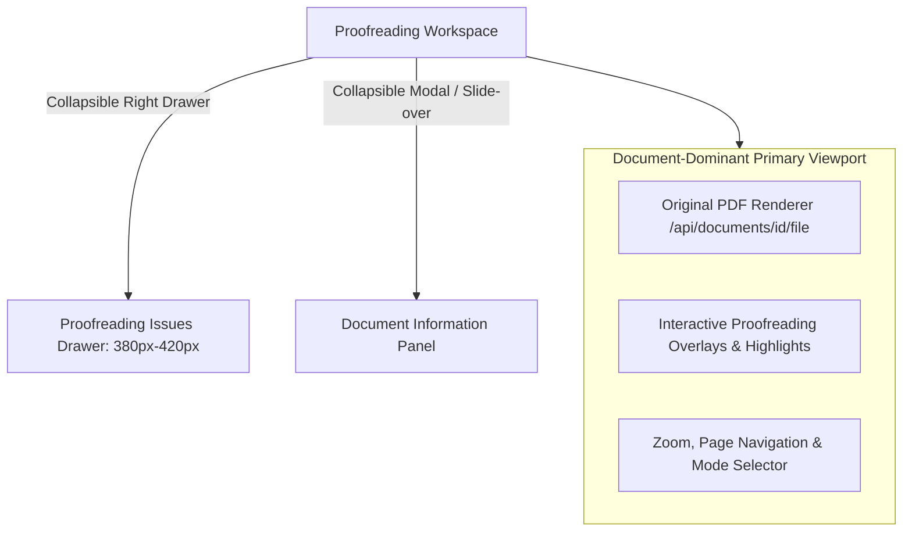

# Proofreading Workspace Layout Redesign Specification

## 1. Executive Summary & Context

The **Interactive Review** workspace in `BTLProject` has been redesigned from a constrained, 3-column layout into a **Document-Dominant Enterprise Workspace**.

Previously, the workspace permanently split horizontal screen real estate into three competing columns:
1. **Document Viewer**: ~45% width (cramped document rendering area, forcing excessive zooming).
2. **Issues Panel**: ~28% width.
3. **Document Details Sidebar**: ~27% width.

For enterprise users reviewing multi-page corporate documents (100–500 pages), this multi-panel dashboard model severely degraded readability. The redesign removes the fixed 3-column constraint and converts secondary panels into collapsible drawers, allowing the **Document Viewer to occupy 80–90%+ of the workspace width**.



---

## 2. Layout Topology Comparison Matrix

```
LEGACY CONSTRAINED LAYOUT (Fixed 3-Column Dashboard)
+------------------------+-------------------+--------------------+
|  Document Viewer (45%) | Issues Panel (28%)| Doc Details (27%)  |
|  (Cramped, zoomed-in)  | (Fixed side rail) | (Fixed sidebar)    |
+------------------------+-------------------+--------------------+

REDESIGNED DOCUMENT-DOMINANT LAYOUT (Drawer Closed - 100% Focus)
+---------------------------------------------------+--------------+
|                                                   | [🎯 Issues   |
|         PRIMARY DOCUMENT VIEWPORT (100% Width)    |    Drawer 12]|
|         High-Fidelity PDF Canvas & Highlights     |              |
+---------------------------------------------------+--------------+

REDESIGNED DOCUMENT-DOMINANT LAYOUT (Drawer Open - 75% / 25% Split)
+------------------------------------------+-----------------------+
|                                          | Issues Drawer (25%)   |
|   PRIMARY DOCUMENT VIEWPORT (75% Width)  | [ 🔤 Spelling  (4) ]  |
|   Spacious layout, smooth readability    | [ ✍️ Grammar   (8) ]  |
+------------------------------------------+-----------------------+
```

| Aspect | Legacy Fixed Layout | Redesigned Workspace |
| :--- | :--- | :--- |
| **Document Viewport Width** | ~45% total screen width | **80%–90%+ (Drawer Open)** / **100% (Drawer Closed)** |
| **Issues Panel** | Fixed 28% side column | **Collapsible Right Drawer (380px–420px)** |
| **Document Metadata Sidebar** | Fixed 27% right sidebar | **Collapsible Information Panel / Modal** |
| **Reading & Review Ergonomics** | Poor (Narrow text column, forced zooming) | **Optimal (Spacious page rendering, crisp text)** |
| **Product Parity** | Multi-card dashboard | **Adobe Acrobat AI Review / MS Word Review Mode** |

---

## 3. Key Architectural Rules

1. **Document-First Hierarchy**: The original PDF document container is the dominant visual anchor of the page.
2. **On-Demand Secondary Content**:
   - **Issues Drawer**: Accessed via floating action badge (`🎯 12 Proofreading Findings`) or header toggle.
   - **Document Information**: Accessed via header button (`ℹ️ Document Details`).
3. **Responsive Canvas Real Estate**:
   - **Large Monitors (1920px+)**: Document Viewer occupies $\ge 85\%$ width.
   - **Desktop Monitors (1440px)**: Document Viewer occupies $\ge 75\%$ width (Drawer Open) or $100\%$ (Drawer Closed).
   - **Drawer Open**: Document Viewer retains $\ge 65\%$ width minimum.

---

## 4. Visual Layout Specifications

- **Container Width**: Extends 100% across available space between left navigation sidebar and viewport edge.
- **Viewport Height**: Expanded to `calc(100vh - 165px)` with a minimum height of `780px`.
- **Margin & Padding Optimization**: Card padding reduced from 24px to 10px; outer margins eliminated to maximize document canvas dimensions.
