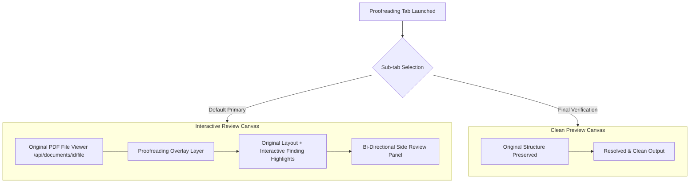
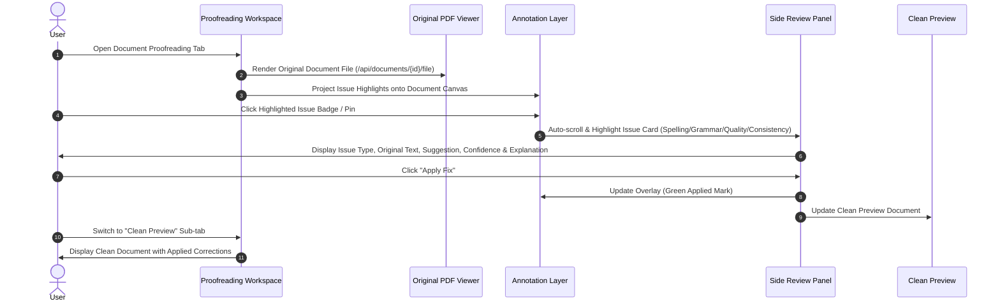

# Proofreading UX Redesign – Interactive Document Review Experience

## 1. Executive Summary & Context

The Proofreading workspace has been transformed from a fragmented 3-tab layout into a unified, high-efficiency **Interactive Document Review Experience**. Previously, users had to constantly switch between three separate tabs:
1. **Full PDF Document Viewer** (static view of the original document)
2. **Interactive Editor** (plain text / reconstructed text representation)
3. **Clean Preview** (view of resolved output)

This fragmented experience created cognitive friction, lost visual context (such as page headers, logos, multi-column layouts, tables, and figures), and forced users to mentally map proofreading findings from extracted text back to the visual PDF document.

### The Redesign Solution
- **Removed**: Standalone **Full PDF Document Viewer** tab.
- **Retained & Unified**: **Interactive Review** (as the primary, default workspace) and **Clean Preview** (as the final corrected view).
- **Core Paradigm**: The original document IS the workspace. When the user opens the Proofreading tab, the **actual original document file** (`/api/documents/{id}/file`) is rendered directly in front of the user in full visual fidelity (images, logos, tables, fonts, formatting, page boundaries), integrated with an interactive **Proofreading Finding Overlay**.



---

## 2. Problem Analysis: The Fragmented 3-Tab Model

| Aspect | Legacy 3-Tab Experience | Redesigned Interactive Experience |
| :--- | :--- | :--- |
| **Workspace Model** | 3 separate modes (`Full PDF Viewer`, `Interactive Editor`, `Clean Preview`) | 2 cohesive modes (`Interactive Review` + `Clean Preview`) |
| **Document Representation** | Text extracted into plain container without original formatting, tables, or logos | Original PDF rendered directly (`/api/documents/{id}/file`) with exact layout, multi-column flow, graphics, and page boundaries |
| **Finding Highlights** | Highlighted on extracted raw text block | Highlighted directly on original document viewer with interactive overlay badges |
| **Cognitive Friction** | High: User must cross-reference findings with PDF viewer | Zero: Findings overlay exact location in original document |
| **Navigation & Controls** | Independent between tabs; PDF viewer had zoom, editor had text scroll | Integrated dual-mode controls (Original PDF + Highlights Overlay vs Text Layout View) |
| **Product Benchmark** | Basic web text editor | Enterprise platforms (Adobe Acrobat AI Review, Grammarly Business, Canvas Proofing) |

---

## 3. Core Principles of the Redesign

### 1. Single Source of Visual Truth
The user works directly on the original document file (`/api/documents/{id}/file`). There is no second, simplified representation of the document created for editing. Images, vectors, custom typography, header/footer margins, multi-column flows, and financial/technical tables remain 100% visually intact and rendered directly in front of the user.

### 2. Zero Context Switching
All original-document viewing features—page navigation, document zoom, text search, and continuous scrolling—exist natively within **Interactive Review**. The user never needs to leave the review environment to check how the original page looks.

### 3. Integrated Annotation Overlay Layer
Findings are projected as interactive visual highlights directly on top of the original document canvas. Hovering or clicking an annotation opens and syncs with the **Side Review Panel**.

### 4. Deterministic Decision Model
Every finding can be resolved with a single click ("Apply Fix" or "Ignore"). Decisions update both the interactive document annotation overlay in real time and the **Clean Preview** output.

---

## 4. User Workflow Comparison



---

## 5. Detailed UX Specifications

### A. Sub-Tab Navigation Header
The Proofreading tab features a simplified 2-option segmented sub-tab control:

```
+-------------------------------------------------------------------------------+
| [ ✏️ Interactive Review ]   [ ✨ Clean Preview ]       [ ↻ Re-run Pipeline ]  |
+-------------------------------------------------------------------------------+
```

- **Interactive Review** (Default): Contains the combined original document PDF viewer, annotation overlay layer, page controls, and side review panel.
- **Clean Preview**: Contains the corrected document preview with options to download clean text and clean reports.

### B. Interactive Review Primary Workspace Layout
The layout uses a split workspace model:
- **Left Panel (Canvas Viewport ~70% width)**: Original document PDF canvas (`/api/documents/{id}/file`) displaying the actual uploaded PDF with page boundaries, graphics, tables, logos, top floating overlay bar, and interactive finding highlights.
- **Right Panel (Review Panel ~30% width)**: Sticky Segmented Category Filter Bar (`All`, `Grammar`, `Spelling`, `Quality`, `Consistency`), Search Box, Bulk Actions (`Accept All`, `Reject All`), and interactive Issue Cards with confidence metrics and 1-click decisions.

### C. Finding Category Color Design Tokens

| Issue Category | Highlight Accent | Light Background | Dark/Border Color | Icon / Badge |
| :--- | :--- | :--- | :--- | :--- |
| **Spelling** | Amber / Orange | `#FEF3C7` | `#D97706` | `🔤 Spelling` |
| **Grammar** | Soft Red / Rose | `#FEE2E2` | `#DC2626` | `✍️ Grammar` |
| **Writing Quality** | Violet / Purple | `#EDE9FE` | `#7C3AED` | `💡 Quality` |
| **Consistency** | Cyan / Teal | `#CFFAFE` | `#0891B2` | `⚖️ Consistency` |
| **Applied Fix** | Soft Emerald Green | `#E2F0D9` | `#059669` | `✓ Applied` |

---

## 6. Verification & Success Criteria

1. **Immediate Original Document Display**: Opening the Proofreading tab immediately renders the actual original PDF document (`/api/documents/{id}/file`) directly in front of the user with findings highlighted on top.
2. **Tab Consolidation**: No separate "Full PDF Document Viewer" tab exists; all original document viewing capabilities are natively integrated into Interactive Review.
3. **Bi-directional Sync**: Clicking a document highlight selects the side panel card, and clicking a side panel card highlights and scrolls to the page canvas position.
4. **Resolution Performance**: Users can resolve issues in place with instant UI feedback and clean preview updates.
