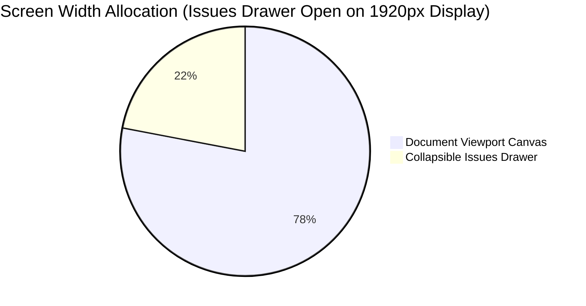

# Responsive Layout Plan & Breakpoint Specification

## 1. Viewport Real Estate Allocation

The responsive layout strategy ensures that the document viewer receives maximum screen real estate across all display sizes, while secondary panels adapt gracefully as collapsible overlays or side drawers.



---

## 2. Width Allocation Matrix Across Viewport States

| Display Breakpoint | Screen Resolution | Issues Drawer Closed | Issues Drawer Open | Document Details Sidebar |
| :--- | :--- | :--- | :--- | :--- |
| **Ultra-Wide Display** | $\ge 2560\text{px}$ | **100%** Document Width | **84%** Document / **16%** Drawer | Collapsible Modal / Panel |
| **Large Enterprise Monitor**| $1920\text{px} \times 1080\text{px}$| **100%** Document Width | **78%** Document / **22%** Drawer | Collapsible Modal / Panel |
| **Standard Laptop / Desktop**| $1440\text{px} \times 900\text{px}$ | **100%** Document Width | **72%** Document / **28%** Drawer | Collapsible Modal / Panel |
| **Compact Laptop** | $1280\text{px} \times 800\text{px}$ | **100%** Document Width | **65%** Document / **35%** Drawer | Collapsible Modal / Panel |
| **Tablet Viewport** | $< 1024\text{px}$ | **100%** Document Width | Overlay Drawer (Full width overlay) | Collapsible Modal / Panel |

---

## 3. Viewport Height Optimization Equations

To prevent unnecessary vertical scrollbars and provide an immersive document reading experience, viewport height is calculated dynamically:

$$\text{ViewportHeight} = \text{window.innerHeight} - (\text{TopHeaderHeight} + \text{BreadcrumbHeight} + \text{BottomMargin})$$

$$\text{ViewportHeight} = 100\text{vh} - 165\text{px} \quad (\text{Min-Height: } 780\text{px})$$

---

## 4. Technical CSS Implementation Strategy

### A. Flexbox / Grid Container Structure
```css
/* Outer Workspace Shell */
.workspace-container {
  display: flex;
  width: 100%;
  height: calc(100vh - 165px);
  position: relative;
  overflow: hidden;
}

/* Primary Document Viewport Container */
.document-viewport-primary {
  flex: 1 1 100%;
  min-width: 0;
  height: 100%;
  transition: flex 0.25s cubic-bezier(0.4, 0, 0.2, 1);
}

/* When Issues Drawer is Open */
.workspace-container.drawer-open .document-viewport-primary {
  flex: 1 1 calc(100% - 400px);
}

/* Collapsible Right Issues Drawer */
.issues-drawer-panel {
  width: 400px;
  height: 100%;
  position: absolute;
  right: 0;
  top: 0;
  transform: translateX(100%);
  transition: transform 0.25s cubic-bezier(0.4, 0, 0.2, 1);
  z-index: 20;
  background: var(--bg-card);
  border-left: 1px solid var(--border);
  box-shadow: -4px 0 20px rgba(0, 0, 0, 0.08);
}

.issues-drawer-panel.is-open {
  position: relative;
  transform: translateX(0);
}
```

---

## 5. Responsive Adaptation Rules

1. **Auto-Collapse on Small Displays**: On viewports $< 1280\text{px}$, the issues drawer automatically collapses to icon-only state upon launch to prioritize document visibility.
2. **Smooth Transitions**: All width adjustments transition smoothly using GPU-accelerated CSS transforms (`cubic-bezier(0.4, 0, 0.2, 1)`).
3. **No Content Reflow**: Document zoom scale is preserved during drawer open/close transitions.
