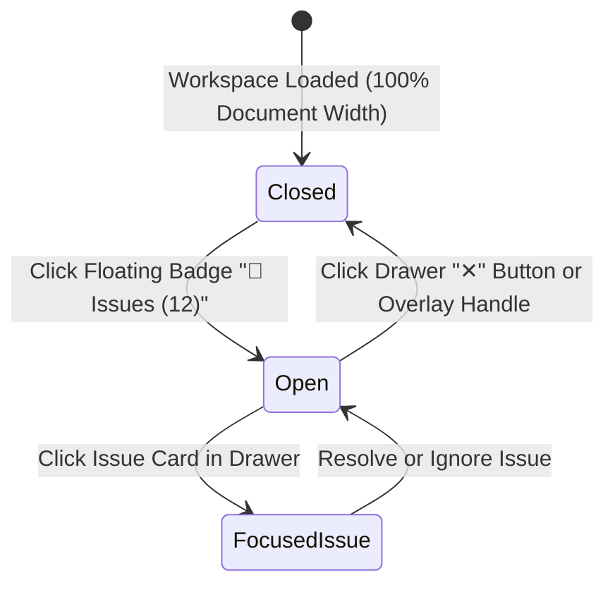

# Proofreading Issues Drawer Design Specification

## 1. Executive Overview

The **Proofreading Issues Drawer** transforms the static, space-consuming side rail into an on-demand slide-in review panel. Moving findings (Spelling, Grammar, Writing Quality, Consistency) into a collapsible drawer frees up horizontal workspace width for the primary PDF document viewer while keeping findings instantly accessible.

```
+--------------------------------------------------------------------------+
|  Primary PDF Document Viewport (80-90%+ Width)                           |
|  High-Fidelity Original Document                                         |
|                                                                          |
|                                         +--------------------------------+
|                                         |  🎯 Issues Drawer (380-420px)  |
|                                         |  [All | Grammar | Spelling]   |
|                                         |  Issue #1 (96% Confidence)     |
|                                         |  "implimentation" ->           |
|                                         |  "implementation"              |
|                                         |  [ ✓ Apply Fix ]  [ ✗ Ignore ] |
|                                         +--------------------------------+
+--------------------------------------------------------------------------+
```

---

## 2. Drawer Interaction States & Behaviors

### A. Closed State (Default Floating Action Trigger)
When closed, the drawer frees up 100% of the document viewing canvas width. It displays a floating badge / toggle button on the upper-right edge of the workspace:

```
[ 🎯 12 Proofreading Findings  (4 🔤 | 8 ✍️) ]
```

- **Visual Badge**: Shows total unresolved issues with category breakdown pills (Spelling, Grammar).
- **Click Handle**: Clicking the badge smoothly slides out the drawer.

### B. Open State (Slide-In Panel)
- **Width**: Adjustable 380px to 420px.
- **Animation**: Hardware-accelerated CSS slide transition (`transform: translateX(0)` with `0.25s cubic-bezier(0.4, 0, 0.2, 1)`).
- **Document Viewport Preservation**: Even when the drawer is fully expanded, the document viewer retains $\ge 65\text{--}75\%$ of total screen width.



---

## 3. Drawer UI Anatomy & Component Spec

1. **Header Row**:
   - Title: `Proofreading Findings (12 Unresolved)`
   - Filter segmented tabs: `All`, `Grammar`, `Spelling`
   - Close handle button: `✕`
2. **Search & Bulk Action Bar**:
   - Search filter input: `Search issues...`
   - Bulk action buttons: `[ Accept All ]`, `[ Reject All ]`
3. **Scrollable Card Rail**:
   - **Severity Accent Bar**: Left border indicator (Yellow = Low, Orange = Medium, Red = High, Dark Red = Critical).
   - **Confidence Metric**: Confidence score badge (e.g. `96% Confidence`).
   - **Diff Box**: Original strikethrough text vs Suggested text in green.
   - **Rationale & Rule**: Rule description explaining the error.
   - **1-Click Decision Actions**: `[ ✓ Apply Fix ]` and `[ ✗ Ignore ]`.

---

## 4. Bi-Directional Viewport Sync

- **Drawer-to-Document**: Clicking an issue card in the drawer smooth-scrolls the original document viewport and highlights the corresponding target text on page $P$.
- **Document-to-Drawer**: Clicking a finding highlight on the PDF document canvas opens the drawer (if closed) and focuses the relevant issue card.
